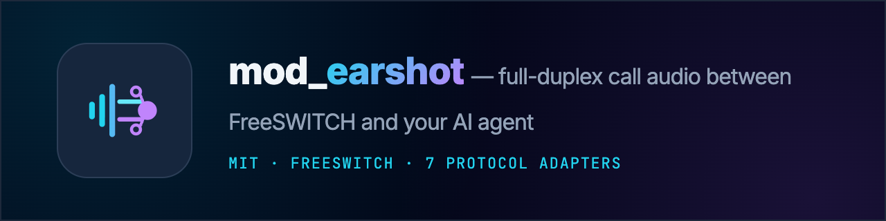

<p align="center">
  
</p>

# Earshot — `mod_earshot`

> A FreeSWITCH module that streams live call audio to your AI agent over a WebSocket —
> and plays the agent's voice back — full duplex, with seven ready-made protocol adapters,
> module-side turn detection, agent-driven call control, PCI masking, multi-stream fan-out,
> and built-in latency metrics.

---

## Why Earshot

Every FreeSWITCH voice-AI write-up hits the same wall: the incumbent module's **playback**
(agent → caller) doesn't work reliably, forcing `uuid_broadcast` hacks. Earshot's `WRITE_REPLACE`
path is validated with real audio, full duplex, on one leg. That's the wedge — everything else builds
on it. The full pitch is in **[WHY.md](WHY.md)**; the complete capability list is in **[FEATURES.md](FEATURES.md)**.

- **7 wire protocols, agent unmodified** — `native`, `twilio`, `openai` (Realtime),
  `deepgram` (Voice Agent), `elevenlabs`, `gemini` (Live), `pipecat`. Swap vendors with one word.
- **Turn-taking for any agent** — module-side VAD → `speech_started`/`speech_stopped`, a ready-gate
  (no "answered into silence"), and speech-triggered barge-in.
- **Agent drives the call** — opt-in, whitelisted control channel: transfer, hangup, DTMF, play,
  record, hold, bridge, setvar.
- **PCI/PII masking** — mute audio + redact DTMF to the agent during card entry.
- **Multi-stream fan-out** — agent + live transcription + supervisor on one call.
- **Latency KPIs** — time-to-first-audio, per-turn response time, WebSocket RTT.
- **Codecs + resampling** — G.711 µ-law/a-law + L16, transparent 8k/16k/24k.
- **Reliable + observable** — reconnect w/ jitter, bounded queue, `earshot::metrics` events,
  correlation by SIP Call-ID + channel UUID.
- **Drop-in migration** — `uuid_audio_stream` / `audio_stream` compat runs mod_audio_stream dialplans unchanged.

---

## Works with your agent

Point `proto=` at your stack — same module, one word different. All adapters are
mock-tested in CI; ✅ marks those also validated end-to-end on a real SIP call (against the live
service, or — for the self-hosted Pipecat wire format — its official protobuf schema).

| Agent / protocol             | `proto=`     | Status               |
|------------------------------|--------------|----------------------|
| OpenAI Realtime              | `openai`     | ✅ live-validated    |
| Deepgram Voice Agent         | `deepgram`   | ✅ live-validated    |
| Native (any WebSocket)       | `native`     | ✅ live-validated    |
| Pipecat                      | `pipecat`    | ✅ validated (protobuf) |
| ElevenLabs Conversational AI | `elevenlabs` | adapter ✓            |
| Google Gemini Live           | `gemini`     | adapter ✓            |
| Twilio Media Streams         | `twilio`     | adapter ✓ · framing echo-tested |

---

## Observability & AI latency — built for scale

`mod_audio_stream` hands you an audio pipe. In production the first question is **"is the agent fast
enough — on every call, right now?"** Earshot answers it with no agent instrumentation: every stream
emits an `earshot::metrics` event (periodic, on-close, or on-demand JSON) carrying the numbers voice
teams actually optimize:

- **Time-to-first-audio** — call start → the agent's first word. The single "does it feel alive?" number.
- **Per-turn response latency** (avg + max) — caller stops → agent starts; catch a slow model or vendor the moment it drifts.
- **WebSocket RTT** — transport health, sampled via ping/pong.
- **Throughput & backpressure** — tx/rx frames + bytes, play-buffer depth, queue drops, reconnects.

At one call it's a debugger; at ten thousand it's your **fleet latency scoreboard** — ship the events
to Prometheus/OTel and alert on p95 time-to-first-audio *per vendor*. Every metric is keyed to the
**two-key trace** (SIP Call-ID + channel UUID), so a single call stitches together across FreeSWITCH,
your agent, and your logs. Lifecycle, DTMF, barge-in/turn, and agent-command events flow over the same
FreeSWITCH event socket — the whole call is observable, the agent untouched.

---

## 60-second quickstart

**1. Build & install** (needs FreeSWITCH dev headers + `libwebsockets-dev`):

```bash
cmake -S . -B build && cmake --build build
sudo cmake --install build        # -> /usr/lib/freeswitch/mod/mod_earshot.so
fs_cli -x "load mod_earshot"
```

**2. Point a call at your agent** — dialplan:

```xml
<extension name="ai-agent">
  <condition field="destination_number" expression="^5000$">
    <action application="answer"/>
    <action application="earshot" data="start ws://127.0.0.1:9099/ws proto=native vad=on vad_barge=on"/>
    <action application="playback" data="silence_stream://-1"/>   <!-- keep the leg up -->
  </condition>
</extension>
```

**3. Any WebSocket agent works.** A minimal echo agent (hear yourself talk):

```python
# pip install websockets
import asyncio, websockets
async def handle(ws):
    async for msg in ws:            # binary caller audio (µ-law 8k by default)
        await ws.send(msg)          # ...echo it straight back to the caller
async def main():
    async with websockets.serve(handle, "0.0.0.0", 9099):
        await asyncio.Future()
asyncio.run(main())
```

Call `5000` and you'll hear yourself — proving both directions. Swap the echo for your LLM,
or point `proto=` at OpenAI/Deepgram/ElevenLabs/Gemini/Pipecat and run your existing agent unchanged.
More recipes (pipecat, OpenAI Realtime, transcription fan-out, PCI masking) in **[QUICKSTART.md](QUICKSTART.md)**.

---

## The command surface

Dialplan **app** (operates on the current channel):

```xml
<action application="earshot" data="start ws://agent/ws proto=openai commands=true metrics=10"/>
```

**API** (fs_cli / ESL — `<uuid>` first, then the verb):

```
earshot <uuid> start ws://agent/ws proto=native [id=<name>] [dir=in|out|both] ...
earshot <uuid> flush                 # barge-in: clear queued agent audio
earshot <uuid> send  '{"type":"..."}'
earshot <uuid> mask  on|off          # PCI: mute audio + redact DTMF to the agent
earshot <uuid> status | metrics      # per-stream JSON (add id=<name> for a fan-out fork)
earshot <uuid> stop
```

Fan-out — many streams on one channel:

```xml
<action application="earshot" data="start ws://agent/ws"/>
<action application="earshot" data="start ws://stt/ws id=transcribe dir=in proto=deepgram"/>
<action application="earshot" data="start ws://mon/ws id=supervisor dir=in"/>
```

Full option/verb/event reference: **[FEATURES.md](FEATURES.md)** · API detail: **[docs/API.md](docs/API.md)** ·
internals: **[docs/ARCHITECTURE.md](docs/ARCHITECTURE.md)**.

---

## Build, package, test

```bash
cmake -S . -B build && cmake --build build   # module (needs FS headers) + unit tests
ctest --test-dir build                       # codec / queue / protobuf unit tests (no FS needed)
cpack --config build/CPackConfig.cmake -G DEB   # -> mod-earshot_*.deb  (when FS headers are present)
docker build -t earshot-build .              # reproducible build image (see Dockerfile)
```

The portable core (codec, protobuf) unit-tests without FreeSWITCH, so CI stays
green on any runner; the module itself compiles where FS dev headers are available. See
[`.github/workflows/ci.yml`](.github/workflows/ci.yml).

## Commercial support & consulting

Earshot is MIT and free to run. If you're taking it — or FreeSWITCH voice-AI generally — to
production, the author (**xpertvoip**) offers paid help:

- **Integration & POC** — a working phone-call → AI-agent bridge on your stack, live in days,
  against the vendor of your choice (OpenAI, Deepgram, Pipecat, or your own WebSocket agent).
- **Bridging your SIP infrastructure to AI voice** — connect an existing FreeSWITCH / SIP carrier
  setup to real-time voice agents cleanly, with correlation, barge-in, and PCI-safe DTMF.
- **Scaling to millions of calls a day** — take a FreeSWITCH + AI-voice deployment horizontal:
  the shared-event-loop transport, fleet architecture, capacity planning, and latency/quality
  tuning so voice agents scale out under real load.
- **Production support & retainers** — on-call, upgrades, and SLA-backed help for teams running
  earshot or a FreeSWITCH voice-AI platform.
- **Training & workshops** — "Production Voice-AI on FreeSWITCH" for your team.

📧 **[xpertvoipai@gmail.com](mailto:xpertvoipai@gmail.com)** — tell me your stack and what you're
building.

## Naming

`Earshot` / `mod_earshot` is a working name (evokes "within earshot"). It's a single token across the
source and CMake — see the note at the top of `src/mod_earshot.c` to rename.

## License

MIT — see [LICENSE](LICENSE). Attribution and provenance in [NOTICE](NOTICE).
Contributions welcome — [CONTRIBUTING.md](CONTRIBUTING.md).
